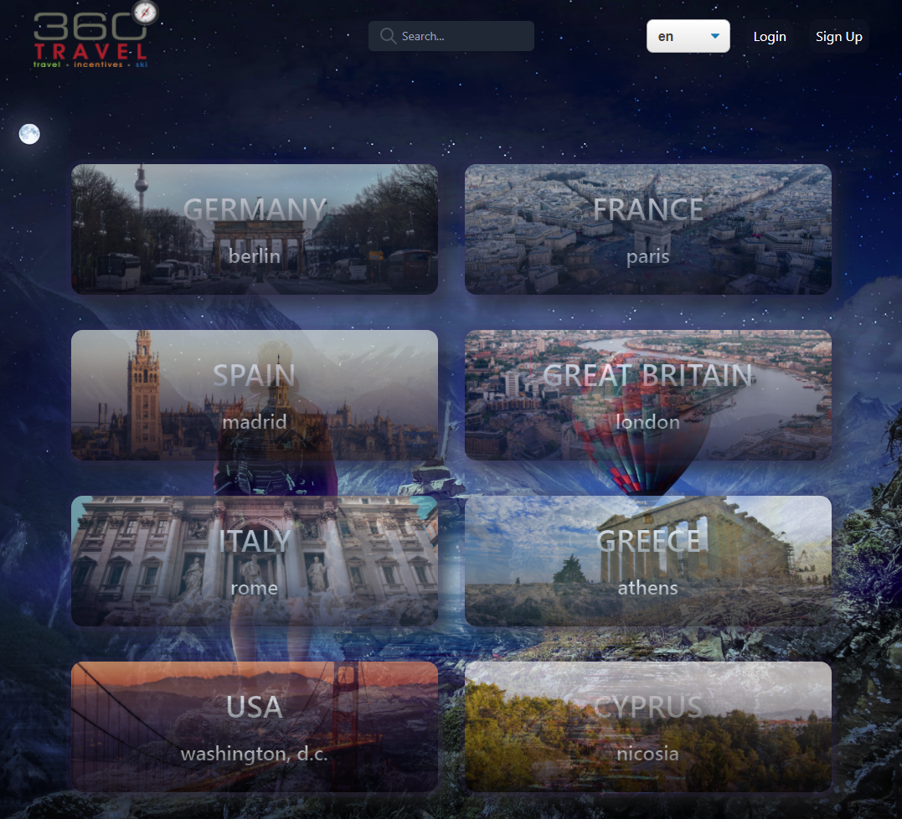
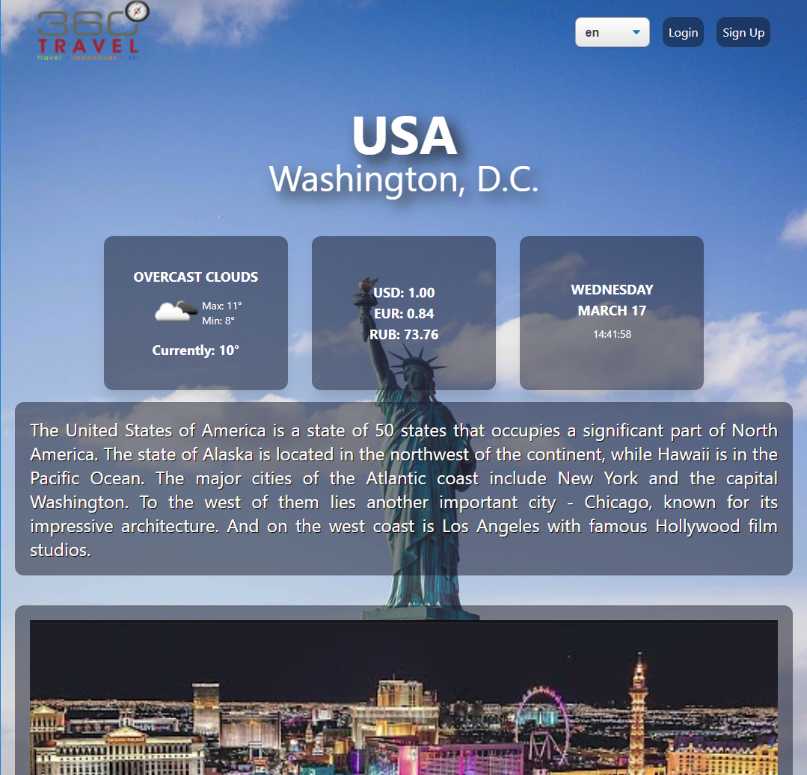
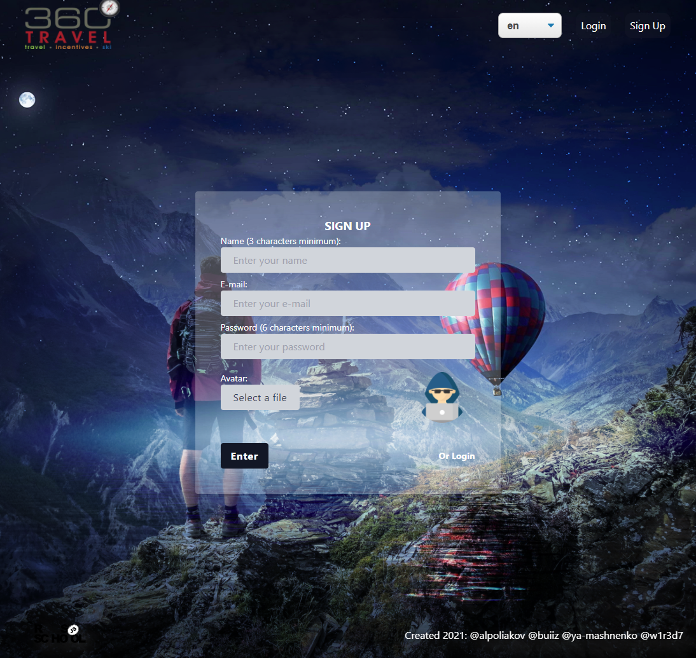
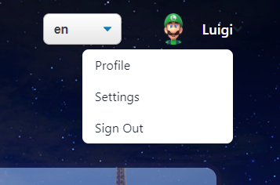
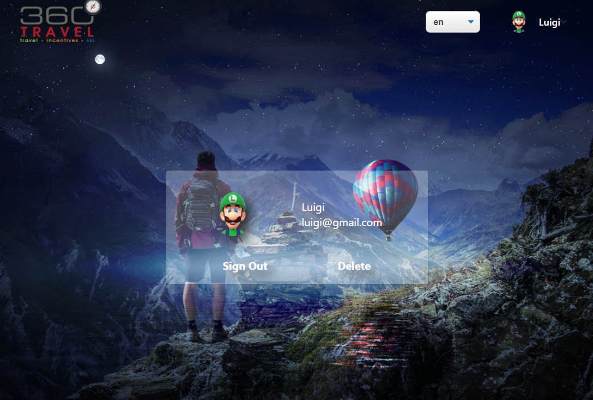
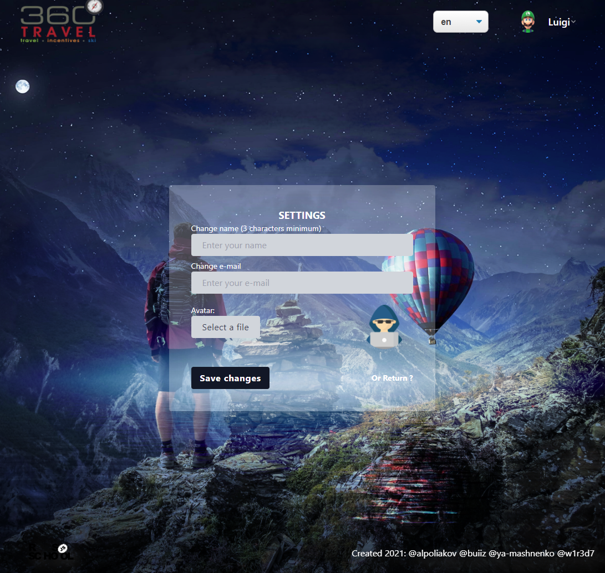
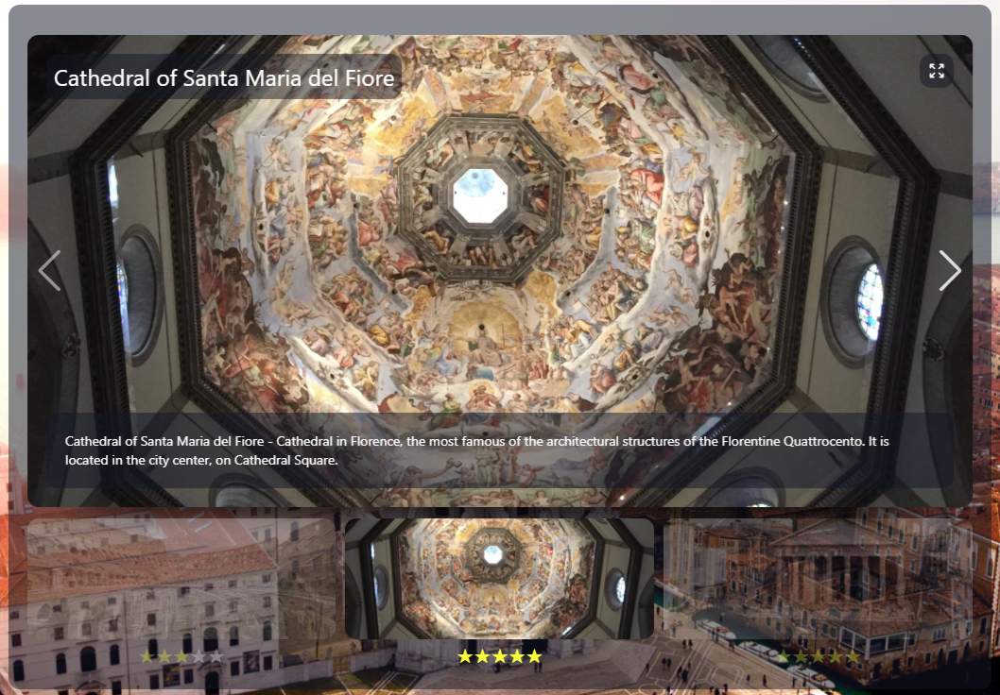
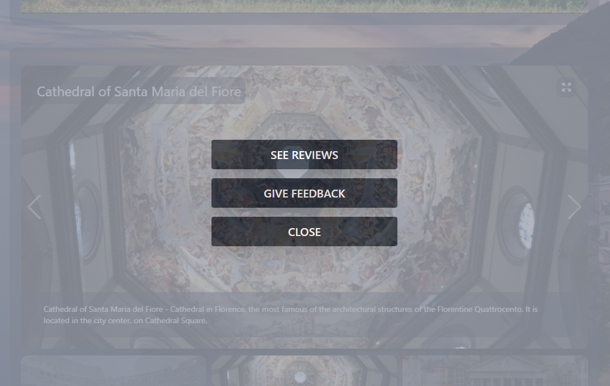
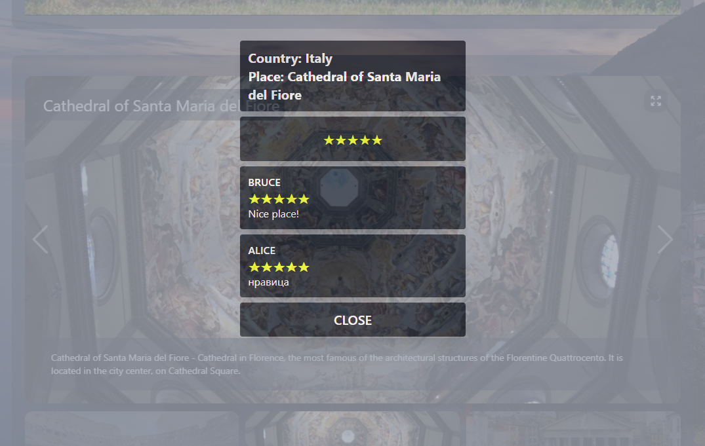
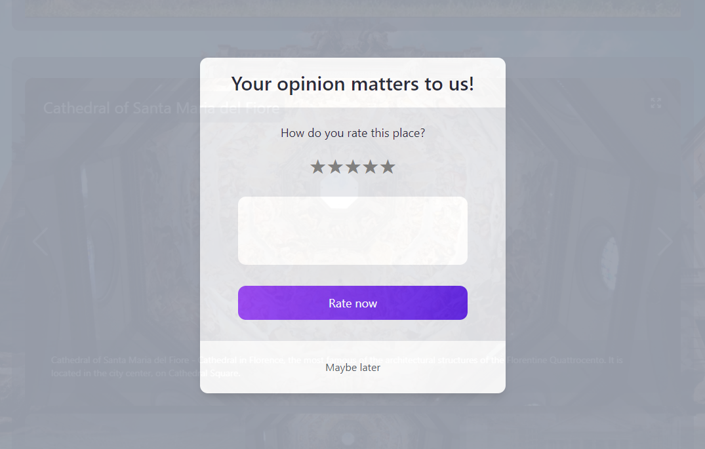

# travel-app

## Описание

Приложение для виртуальных путешествий по странам мира

Приложение состоит из нескольких страниц. Таких как главная, страница страны, настройки, профиль а также регистрации и авторизации.

_Главная страница_

На главной странице есть список из стран которые можно посетить и поиск по странам. Открыв страницу страны вы увидите ее название, столицу, виджеты(погода, курс валют, дата и время), описание, видео, галерею с достопримечательностями и карту на которой отмечена страна и ее столица.

_Страница страны_

Также на каждой странице есть хедер и футер. В хедере есть лого (клик по которому возвращает на главную страницу), меню смены языка страницы и меню пользователя(если пользователь авторизован). В футере есть логотип и список авторов проекта.

_Страница регистрации_

Есть возможность зарегистрироваться/авторизоваться. Для регистрации нужно нажать на соответствующею кнопку в хедере, заполнить все поля (имя, емейл, пароль и аватар) и подтвердить. Аналогичным образом можно авторизоваться.

_Меню пользователя_

В профиле пользователь может вийти из аккаунта или удалить его.

_Профиль пользователя_

В настройках можно изменить имя емейл или аватар.

_Настройки пользователя_

Авторизированный пользователь имеет возможность оставлять оценки достопримечательностям в галереи. Для этого нужно кликнуть на миниатюру достопримечательности

_Галерея_

_Меню отзывов_

_Отзывы_

_Оставить отзыв_

## Архитектура и технологии

### Back-end

- Node.js
- Express
- GraphQL
- MongoDB

### Front-end

- React
- Next.js
- Apollo
- TypeScript
- Tailwind CSS
- Framer Motion

### Тестирование

- Jest
- testing-library
